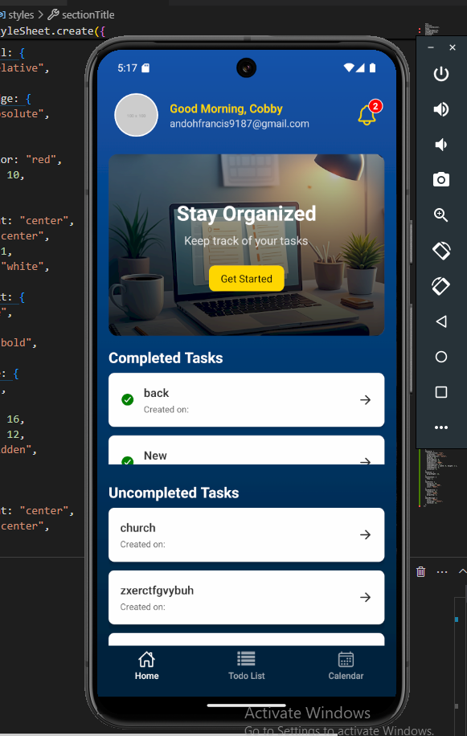

<a name="readme-top"></a>

<div align="center">
  <h1><b>React Native To-Do App</b></h1>
</div>

<!-- TABLE OF CONTENTS -->

# 📗 Table of Contents

- [📖 About the Project](#about-project)
  - [🛠 Built With](#built-with)
    - [Tech Stack](#tech-stack)
    - [Key Features](#key-features)
  - [🚀 Live Demo](#live-demo)
- [💻 Getting Started](#getting-started)
  - [Setup](#setup)
  - [Prerequisites](#prerequisites)
  - [Install](#install)
  - [Usage](#usage)
  - [Run tests](#run-tests)
  - [Deployment](#deployment)
- [👥 Authors](#authors)
- [🔭 Future Features](#future-features)
- [🤝 Contributing](#contributing)
- [⭐️ Show your support](#support)
- [🙏 Acknowledgements](#acknowledgements)
- [❓ FAQ](#faq)
- [📝 License](#license)

---

<!-- PROJECT DESCRIPTION -->

# 📖 React Native To-Do App <a name="about-project"></a>

**React Native To-Do App** is a mobile application built using React Native that allows users to manage their tasks efficiently. Users can add, edit, delete, and mark tasks as complete.

## 🛠 Built With <a name="built-with"></a>

### Tech Stack <a name="tech-stack"></a>

<details>
  <summary>Client</summary>
  <ul>
    <li><a href="https://reactnative.dev/">React Native</a></li>
    <li><a href="https://redux-toolkit.js.org/">Redux Toolkit</a></li>
    <li><a href="https://axios-http.com/">Axios</a></li>
    <li><a href="https://expo.dev/">Expo</a></li>
  </ul>
</details>

<details>
<summary>Backend</summary>
  <ul>
    <li><a href="http://crudapi.infinityfreeapp.com/?i=1/api/documentation/">TODO API END POINT</a> (for API testing)</li>
  </ul>
</details>

---

### Key Features <a name="key-features"></a>

- **Add new tasks** with title and description.
- **Edit existing tasks** for updates or corrections.
- **Mark tasks as complete** or incomplete.
- **Delete tasks** from the list.

<p align="right">(<a href="#readme-top">back to top</a>)</p>

---

## 🚀 Live Demo <a name="live-demo"></a>

- Coming soon...

## Screenshots


<p align="right">(<a href="#readme-top">back to top</a>)</p>

---

## 💻 Getting Started <a name="getting-started"></a>

To get a local copy up and running, follow these steps.

### Prerequisites

Ensure you have the following installed:
- [Node.js](https://nodejs.org/)
- [Expo CLI](https://docs.expo.dev/get-started/installation/)
- A code editor (e.g., [VS Code](https://code.visualstudio.com/))

### Setup

Clone this repository:

```sh
git clone https://github.com/CobbyElsonfx/TodoApp
cd react-native-todo-app
```


## Install
### Install dependencies:

```
npm install
``` 

## Usage
### Run the app locally:
```
expo start
```
## Run tests
### To run tests:

```
npm test
```
## Deployment
### Build the app for production:

```
expo build:android
expo build:ios
``` 
<p align="right">(<a href="#readme-top">back to top</a>)</p>
👥 Authors <a name="authors"></a>
👤 Andoh Francis

GitHub: @[Cobby Elsonfx](https://github.com/CobbyElsonfx)

<p align="right">(<a href="#readme-top">back to top</a>)</p>
🔭 Future Features <a name="future-features"></a>
Add user authentication.

Add task reminders and notifications.
<p align="right">(<a href="#readme-top">back to top</a>)</p>
🤝 Contributing <a name="contributing"></a>
Contributions, issues, and feature requests are welcome!
Feel free to check the issues page.

<p align="right">(<a href="#readme-top">back to top</a>)</p>
⭐️ Show your support <a name="support"></a>
If you like this project, please star it or share it with others!

<p align="right">(<a href="#readme-top">back to top</a>)</p>
🙏 Acknowledgements <a name="acknowledgements"></a>
I would like to thank:

React Native for their amazing framework.
Expo for simplifying mobile development.
<p align="right">(<a href="#readme-top">back to top</a>)</p>
❓ FAQ <a name="faq"></a>
Can I use this project for my personal app?
Yes, this project is MIT licensed.

Can I contribute to this project?
Absolutely! Contributions are welcome.

<p align="right">(<a href="#readme-top">back to top</a>)</p>
📝 License <a name="license"></a>
This project is MIT licensed.

<p align="right">(<a href="#readme-top">back to top</a>)</p> ```


